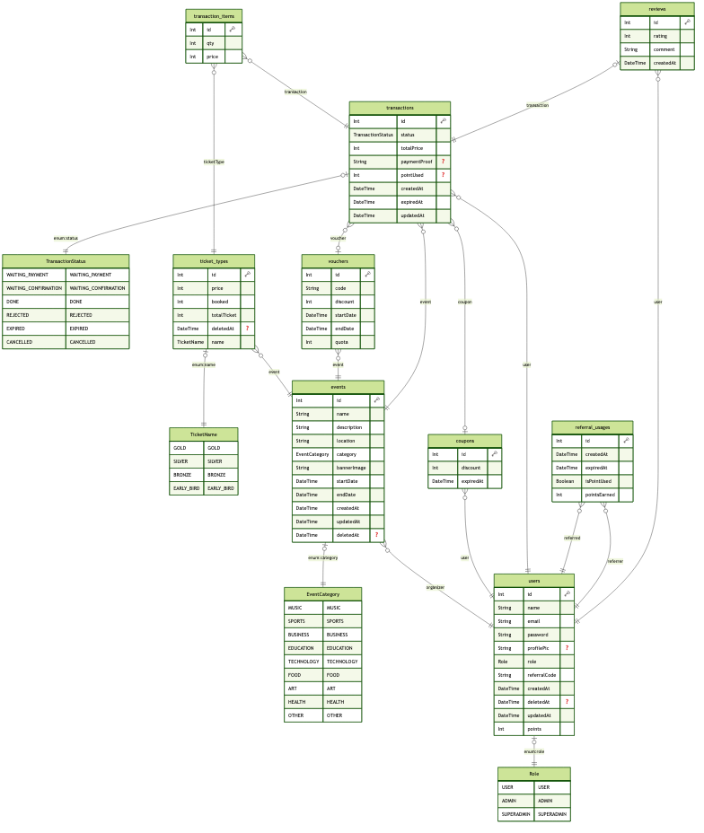

# 🎟️ MyEvent

**Platform manajemen event end-to-end** yang memungkinkan penyelenggara membuat acara, mengelola tiket, serta memfasilitasi pengguna untuk membeli tiket dengan sistem voucher dan poin.

---

## ✨ Main Features

- **Event Management**: Penyelenggara dapat membuat, mengedit, dan memantau event.
- **Ticket System**: Sistem pemesanan tiket dengan berbagai kategori (Gold, Silver, Bronze, dsb).
- **Voucher & Coupon**: Diskon dinamis untuk setiap event menggunakan kode voucher atau kupon pengguna.
- **Loyalty Points**: Penggunaan poin referal untuk potongan harga transaksi.
- **Payment Verification**: Sistem upload bukti bayar dengan verifikasi dari pihak admin/organizer.
- **Dashboard & Analytics**: Monitoring transaksi dan statistik event.
- **Role-Based Access**: Mendukung akses untuk User, Admin (Organizer), dan Superadmin.

---

## 🛠 Tech Stack

| Tier          | Technology                                                                       |
| ------------- | -------------------------------------------------------------------------------- |
| **Frontend**  | React 19, Vite, TailwindCSS (v4), TanStack Query, Zustand, Axios, React Router 8 |
| **Backend**   | Node.js, Express 5, Prisma ORM, PostgreSQL                                       |
| **Utilities** | Cloudinary, Nodemailer, Zod, Node-Cron                                           |

---

## 🗄️ Database ERD



---

## 🚀 How to Run Locally

### Prerequisites

- Node.js (v20+ recommended)
- PostgreSQL
- Cloudinary Account

### Backend

```bash
cd backend
cp .env.example .env
npm install
npx prisma db push
npm run dev

```

### Frontend

```bash
cd ../frontend
cp .env.example .env
npm install
npm run dev

```

---

## 🌐 Deployment URLs

- **Frontend**: [Klik di sini](https://www.google.com/search?q=%23)
- **Backend**: [Klik di sini](event-organizer-backend-production-8c08.up.railway.app)

---

## 🔑 Demo Accounts

| Role           | Email                   | Password      |
| -------------- | ----------------------- | ------------- |
| **Superadmin** | `admin@example.com`     | `password123` |
| **Organizer**  | `organizer@example.com` | `password123` |
| **User**       | `user@example.com`      | `password123` |
